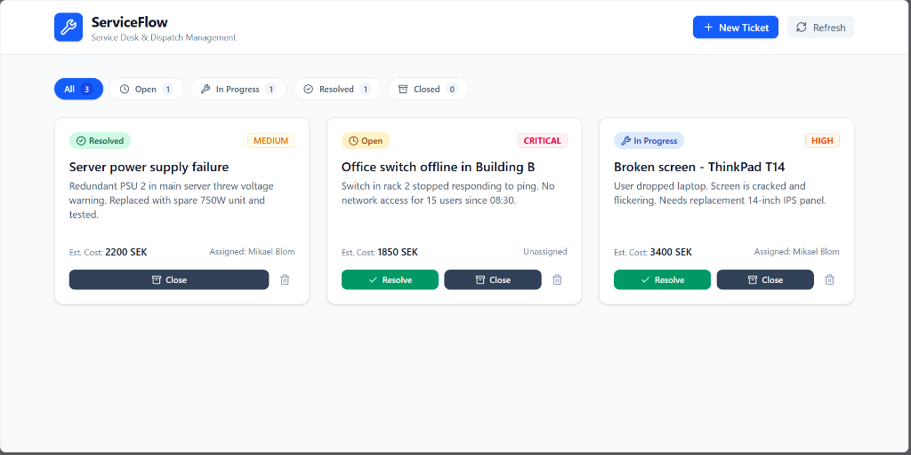

# ServiceFlow

A full-stack service desk application where companies can manage customer support tickets. Built with **ASP.NET Core 10 Web API** on the backend and **React 19 + TypeScript** on the frontend, with **PostgreSQL** as the database.

The whole system runs with a single `docker compose up` command.



## What Does It Do?

ServiceFlow is basically a ticket management system for field service / IT support companies. You can:

- Create support tickets with title, description, priority and estimated cost
- Assign tickets to employees (technicians)
- Track ticket status: **Open → In Progress → Resolved → Closed**
- Filter tickets by status on the dashboard
- View all customers and employees

The idea is that a customer calls with a problem (broken screen, network issue, etc.), and the company creates a ticket, assigns a technician, and tracks it until it's done.

## Architecture

The backend follows a **Clean Architecture** (layered) pattern with 3 projects:

```
ServiceFlow.Api              →  Controllers, DTOs, Middleware (HTTP layer)
    ↓
ServiceFlow.Infrastructure   →  EF Core DbContext, PostgreSQL services
    ↓
ServiceFlow.Core             →  Entities, Interfaces, Enums, Value Objects (no dependencies)
```

- **Core** has zero external dependencies. It only contains the domain model (entities, enums, interfaces).
- **Infrastructure** implements the interfaces from Core using Entity Framework Core + PostgreSQL.
- **API** is the entry point. It registers everything with Dependency Injection and exposes REST endpoints.

This way, the business logic doesn't know anything about the database or HTTP — it only knows its own rules.

## Tech Stack

**Backend:**
- ASP.NET Core 10 (.NET 10)
- Entity Framework Core 10 (Code-First)
- PostgreSQL
- Swagger / OpenAPI

**Frontend:**
- React 19
- TypeScript
- Vite
- Tailwind CSS 4

**Other:**
- Docker & Docker Compose
- xUnit (unit tests)

## How to Run

### Option 1: Docker Compose (easiest)

Just run this in the project root:

```bash
docker compose up --build
```

This starts 3 containers:
| Service | URL |
|---------|-----|
| PostgreSQL Database | `localhost:5432` |
| ASP.NET Core API | `http://localhost:5021` |
| React Frontend | `http://localhost:5173` |

The database gets created and seeded with demo data automatically on first run.

### Option 2: Run Manually

If you want to run without Docker:

1. Make sure you have **PostgreSQL** running on `localhost:5432` with a database called `serviceflow`
2. Start the backend:
   ```bash
   cd src/ServiceFlow.Api
   dotnet run
   ```
3. Start the frontend:
   ```bash
   cd src/ServiceFlow.Web
   npm install
   npm run dev
   ```

## API Endpoints

| Method | Endpoint | Description |
|--------|----------|-------------|
| GET | `/api/tickets` | Get all tickets |
| GET | `/api/tickets/{id}` | Get ticket by ID |
| GET | `/api/tickets/customer/{customerId}` | Get tickets for a customer |
| GET | `/api/tickets/employee/{employeeId}` | Get tickets for an employee |
| POST | `/api/tickets` | Create a new ticket |
| PUT | `/api/tickets/{id}/assign` | Assign ticket to employee |
| PUT | `/api/tickets/{id}/resolve` | Mark ticket as resolved |
| PUT | `/api/tickets/{id}/close` | Close a ticket |
| DELETE | `/api/tickets/{id}` | Delete a ticket |
| GET | `/api/customers` | Get all customers |
| GET | `/api/customers/{id}` | Get customer by ID |
| POST | `/api/customers` | Create a new customer |
| GET | `/api/employees` | Get all employees |
| GET | `/api/employees/{id}` | Get employee by ID |
| POST | `/api/employees` | Create a new employee |

Swagger UI is available at `http://localhost:5021/swagger` when running in Development mode.

## Project Structure

```
ServiceFlow/
├── src/
│   ├── ServiceFlow.Api/            # Web API (controllers, DTOs, middleware)
│   ├── ServiceFlow.Core/           # Domain layer (entities, interfaces, enums)
│   ├── ServiceFlow.Infrastructure/ # Data layer (EF Core, PostgreSQL, migrations)
│   └── ServiceFlow.Web/            # React frontend
├── tests/
│   └── ServiceFlow.Core.Tests/     # Unit tests (xUnit)
├── docker-compose.yml
└── ServiceFlow.slnx
```

## Some Design Decisions

- **Money as a Value Object**: Estimated cost is stored as a `record struct` with Amount + Currency, not just a plain decimal. This is a DDD (Domain-Driven Design) pattern that makes the model more expressive.

- **State transitions on the entity**: Instead of setting `ticket.Status = Resolved` from the controller, the entity has methods like `ticket.Resolve()` and `ticket.Close()`. This keeps the business rules inside the domain model, not scattered across controllers.

- **Global exception handling**: There is a middleware (`ExceptionHandlingMiddleware`) that catches all unhandled exceptions and returns a clean JSON error response using the RFC 7807 ProblemDetails format. So the API never returns raw stack traces to the client.

- **Auto-migration on startup**: When the API starts, it automatically applies any pending EF Core migrations and seeds demo data. This makes it easy to just start the app and have everything ready.

## Running Tests

```bash
dotnet test
```

This runs the xUnit tests in `tests/ServiceFlow.Core.Tests`. The tests verify domain logic (such as ticket state transitions, preventing changes to closed tickets, and Money value object arithmetic).

## Known Limitations & Roadmap

This project focuses primarily on clean backend architecture, domain modeling, and database integration. Areas planned for future iterations include:

- **Authentication & Authorization**: Adding JWT authentication so technicians only see assigned tickets and administrators have full dispatch control.
- **Request Validation**: Adding FluentValidation or Data Annotations to request DTOs for stricter input checks.
- **CI/CD Pipeline**: Setting up a GitHub Actions workflow to run `dotnet test` and build Docker images on every push.
- **Component Breakdown**: Splitting `App.tsx` in the frontend into dedicated smaller components (`TicketCard`, `FilterBar`, `CreateTicketModal`).
